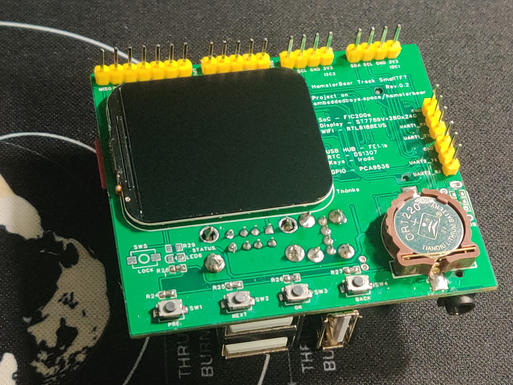
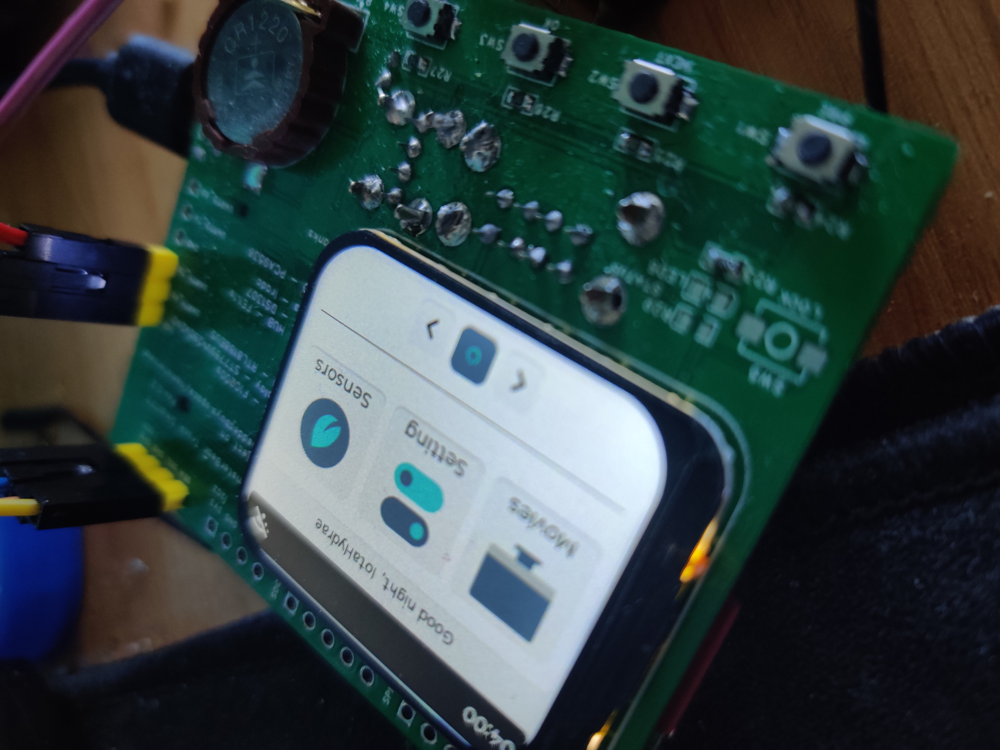
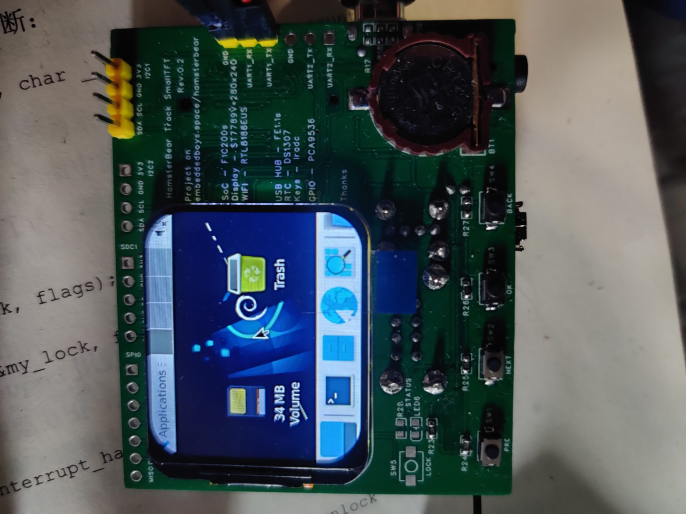

## lvgl
HamsterBear 基于lvgl的第一版桌面

--------------------------------------------

## lvgl
HamsterBear 基于lvgl的第二版桌面

--------------------------------------------

## vim
Debian文件系统 vim展示

--------------------------------------------

## xfce4
Debian 文件系统xfce桌面展示

--------------------------------------------
