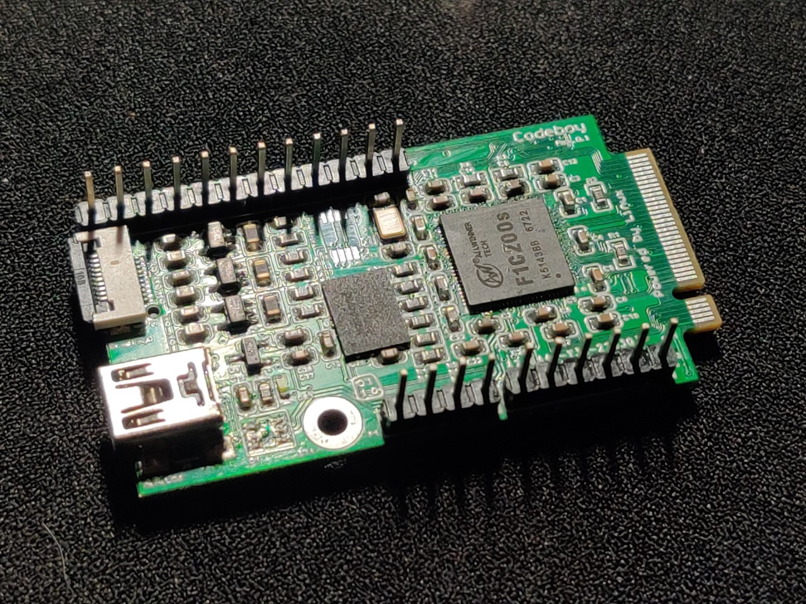
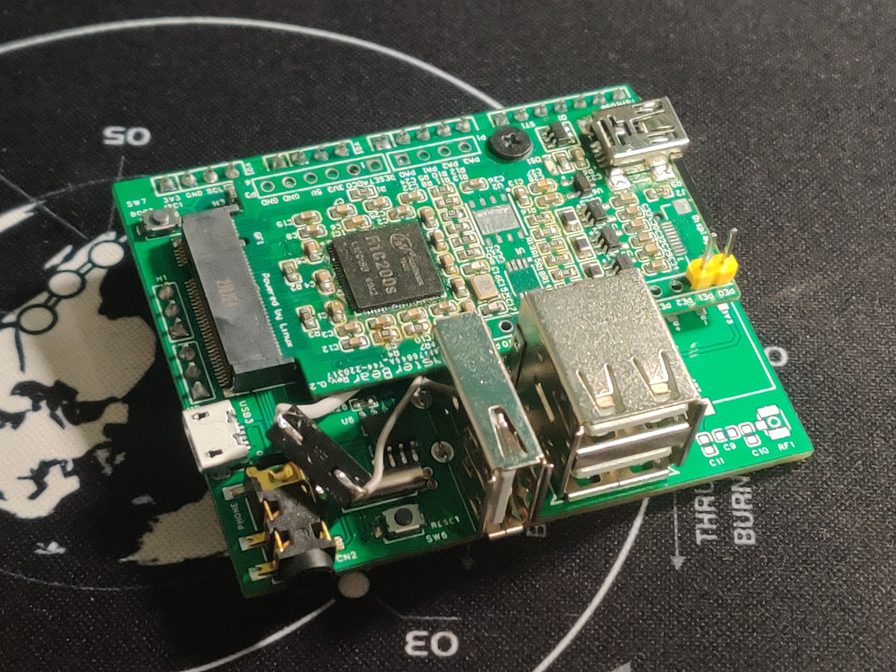
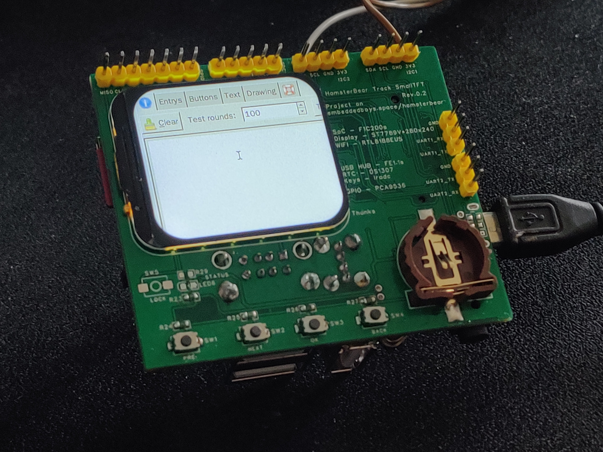

#  仓鼠熊 HamsterBear
------

官方网站:
[`https://embeddedboys.github.io/HamsterBear`](https://embeddedboys.github.io/HamsterBear)

仓库地址:
[`https://github.com/embeddedboys/HamsterBear`](https://github.com/embeddedboys/HamsterBear)

[**`HamsterBear(仓鼠熊)`**]() 是基于[`Allwinner（全志科技）`](https://www.allwinnertech.com/)[`F1C200s`]() SoC 设计的嵌入式 Linux 开发板，我们在 `3x5cm` 尺寸上的PCB集成了众多功能，并且采用了M.2接口，方便开发多种多样的底板。

为了让其更加生动形象，我们给 `HamsterBear` 的底板取了个外号叫做 **`履带(Track)`**，这是我们给它设计的第一款底板 **`HamsterBear Track Wireless`**，已经合并进仓库 `hardware` 中。毫无疑问的是，未来还会有更多种类的底板，
比如掌机、户外辅助、口袋相机等等，一切都在计划之中。

基于 [`lvgl`](https://lvgl.io) 的桌面环境 [`HamsterBearHelmet`](https://github.com/embeddedboys/HamsterBearHelmet)

[`点击查看更多实物图`](assets/gallery.md)

## 软件配置
------

* `SoC` - Allwinner F1C200s

* `Kernel` - mainline v5.17

* `U-Boot` - mainline v2022.2

* `Buildroot` - mainline v2022.2

* `lvgl` - mainline v8.2

## 工程结构
------
    docs/                           # 本站工程
        
    hardware/                       # 有关硬件设计的部分
        core/                       # 核心板
        datasheets/                 # 芯片手册
        tracks/                     # 底板

    software/                       # 有关软件设计的部分
        bsp/                        # 项目的最小系统工程
            u-boot/                 # u-boot工程
            linux/                  # linux工程
            buildroot/              # buildroot工程
            toolchain/              # 交叉编译工具链

        packages/                   # 外部的应用软件

    references/                    # 本项目所参考的内容

    LICENSE                        # 本项目的许可证
    AUTHORS                        # 本项目涉及到的作者
    THANKS                         # 致谢
    README.md                      # 项目自述文件

## 说明
------
如果你打算从该工程的基础上进行二次开发，请阅读开发者页面中的内容。

工程发布于 MIT 许可证下，有关该许可证的详细信息，请到 `关于 -> 许可证` 中查看

## [`FAQs`](FAQs.md)
-------
