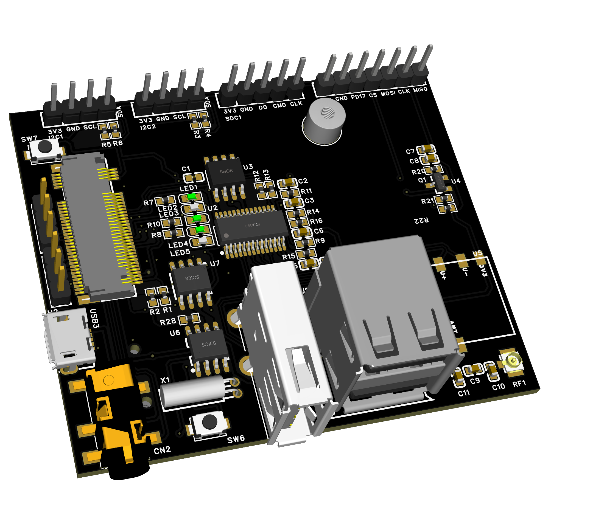

#  仓鼠熊 HamsterBear
------

官方网站:
[`https://embeddedboys.github.io/HamsterBear`](https://embeddedboys.github.io/HamsterBear)

仓库地址:
[`https://github.com/embeddedboys/HamsterBear`](https://github.com/embeddedboys/HamsterBear)

[**`HamsterBear(仓鼠熊)`**]() 是基于[`Allwinner（全志科技）`](https://www.allwinnertech.com/)[`F1C200s`]() SoC 设计的嵌入式 Linux 开发板，我们在 `3x5cm` 尺寸上的PCB集成了众多功能，并且采用了M.2接口，方便开发多种多样的底板。

为了让其更加生动形象，我们给`HamsterBear`的底板取了个外号叫做**`履带(Track)`**，这是我们给它设计的第一款底板 `HamsterBear Track Wireless`

## 软件配置
------

* `SoC` : F1C200s arm926-ejs

* `Kernel` - mainline v5.17

* `U-Boot` - mainline v2022.2

* `Buildroot` - v2022.2
    X Server
    Gtk
    python3
    VNC
    Qt5等

## 工程结构
------
    docs/                           # 本站工程
        
    hardware/                       # 有关硬件设计的部分
        core/                       # 核心板
        datasheets/                 # 芯片手册
        tracks/                     # 底板

    software/                       # 有关软件设计的部分
        bootable/                   # 可启动文件
        bsp/                        # 项目的最小系统工程
            u-boot/                 # u-boot工程
            linux/                  # linux工程
            buildroot/              # buildroot工程
            toolchain/              # 交叉编译工具链

        modules/                    # 外部的驱动程序
        packages/                   # 外部的应用软件
        scripts/                    # 脚本

    references/                    # 本项目所参考的内容

    LICENSE                        # 本项目的许可证
    README.md                      # 项目自述文件

## 说明
------
如果你打算从该工程的基础上进行二次开发，请阅读开发者页面中的内容。

工程发布于 MIT 许可证下，有关该许可证的详细信息，请到 `关于 -> 许可证` 中查看

## FAQ
------

#### 1. 酷，我接下来应该做什么？
`快速入门` 章节里介绍了基本的用法，更详细的用法位于 `开发者->软、硬件文档`
